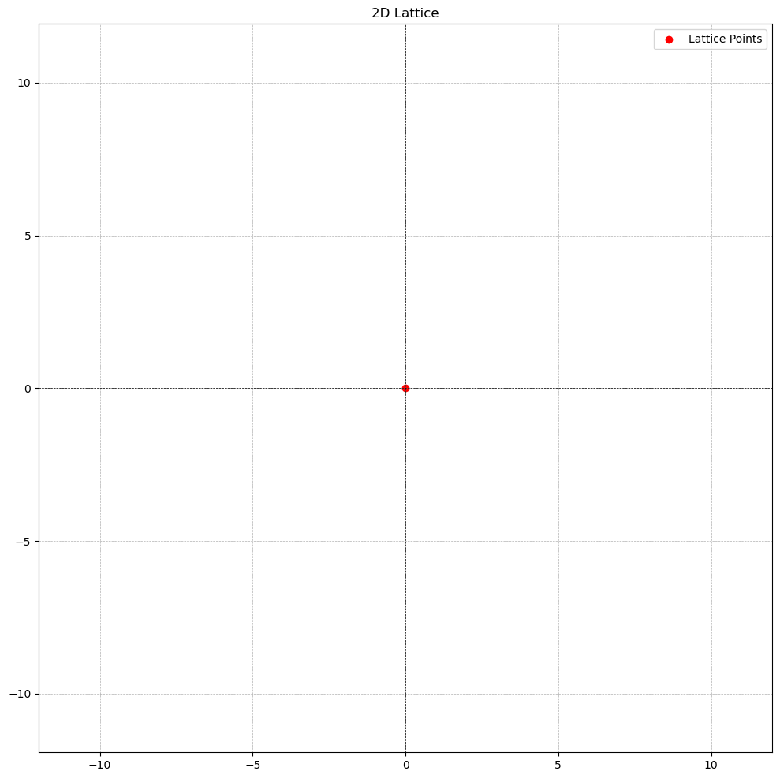
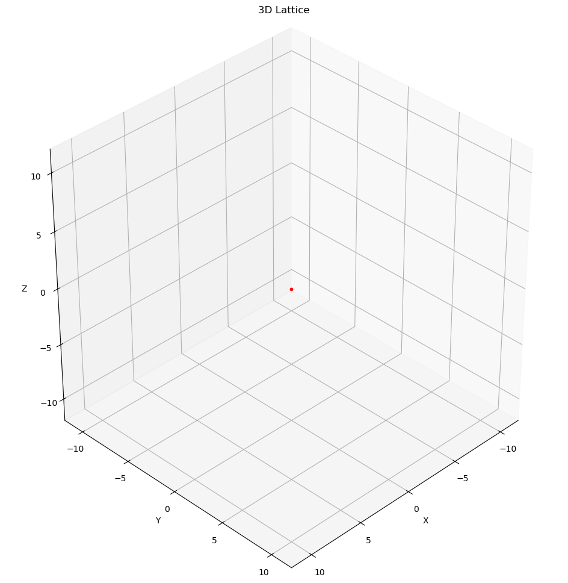
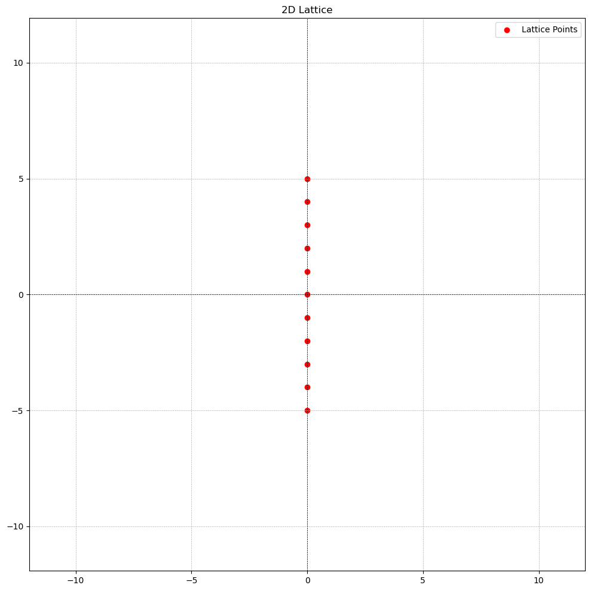
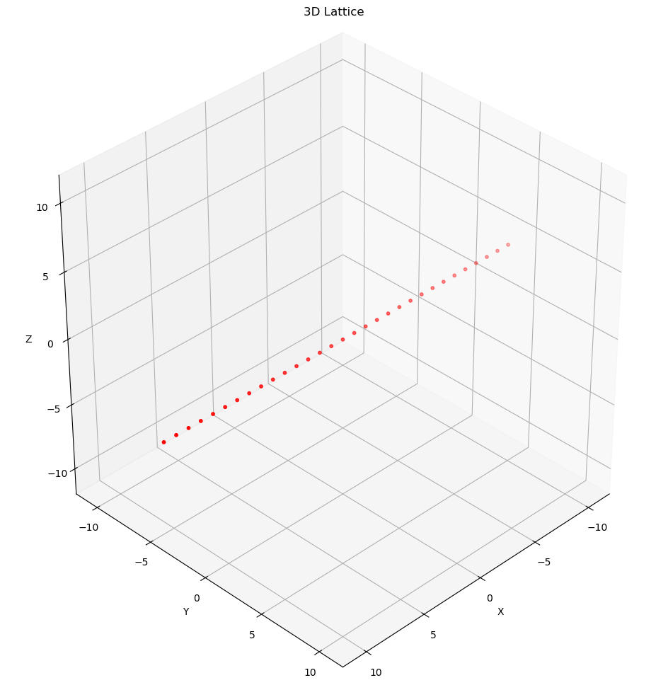
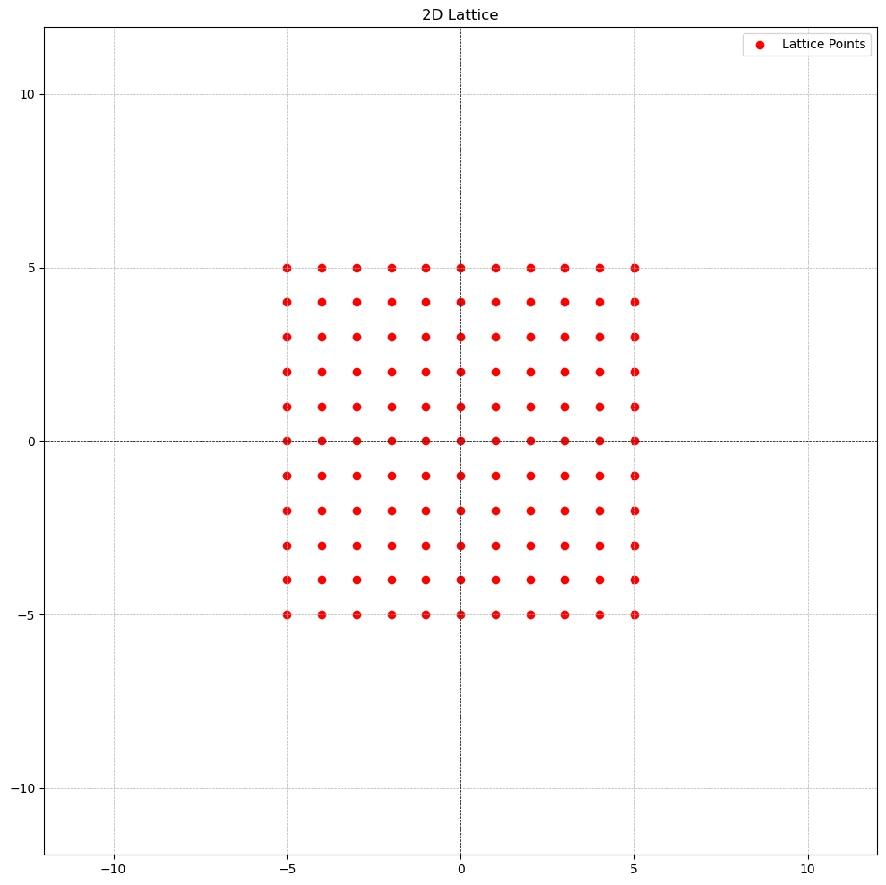
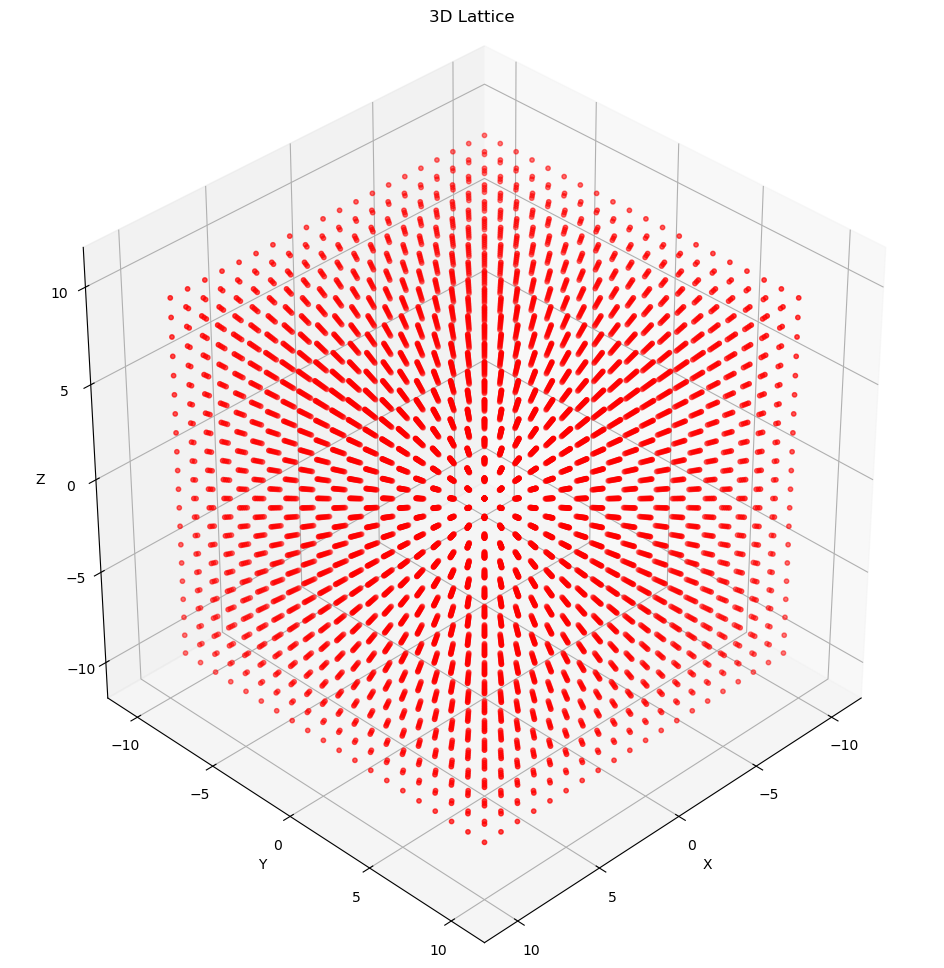
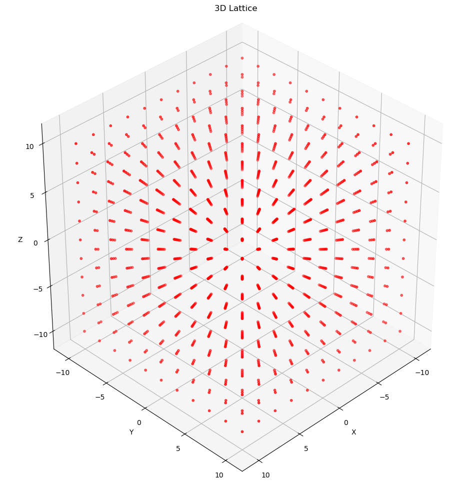
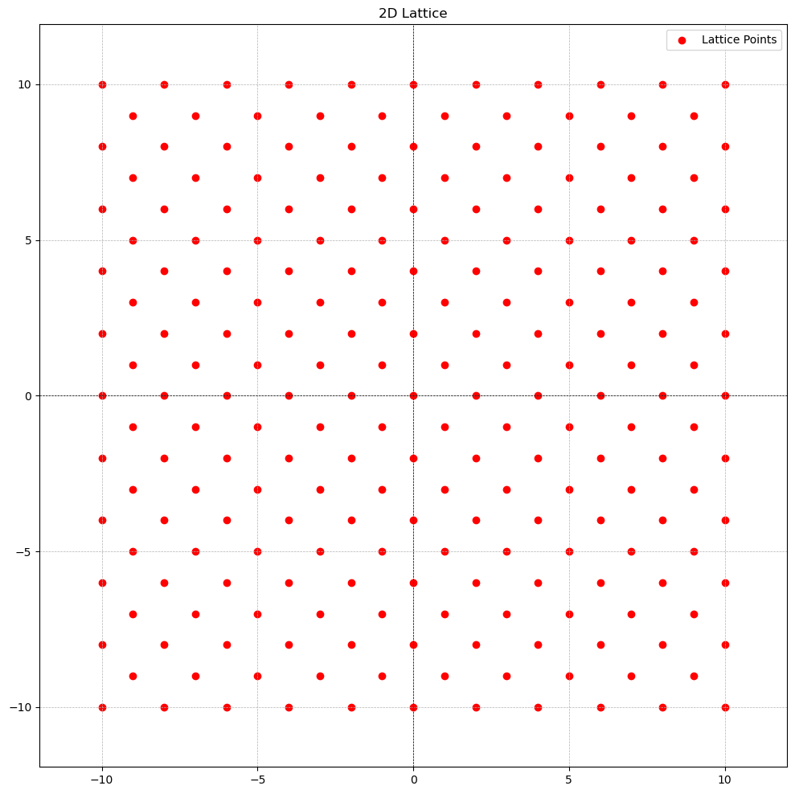
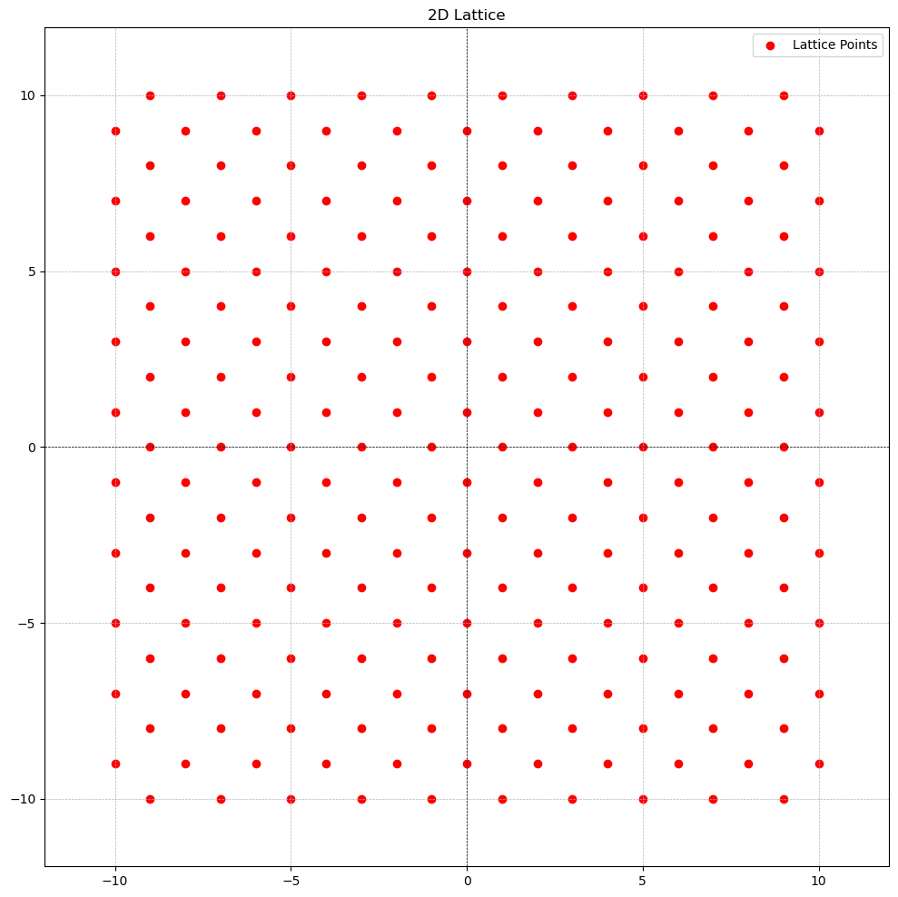
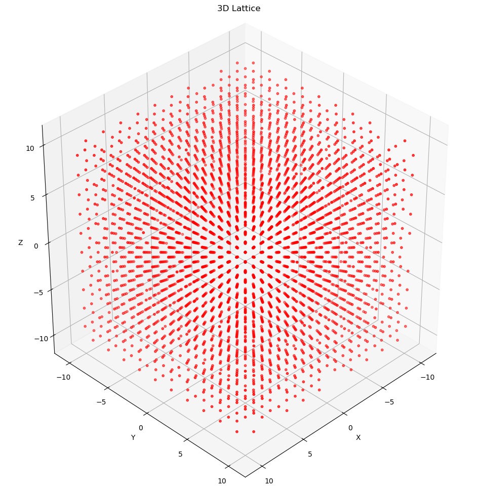

# fundamentals of lattice-based cryptography

## what is a lattice?

An $n$-dimensional *lattice* $L$ is a discrete addictive subgroup of $\mathbb{R}^n$

- **discrete**: This means that every point $x \in L$ has some "neighborhood" in which $x$ is the only lattice point. That is, for every point $x$ there is "good" space around it
- **addictive subgroup**: a lattice $L$ is an addictive subgroup if it contains identity element $0 \in \mathbb{R}^n$(the all-zeros vector), and if any $x, y \in L$, we have $-x \in L$ and $x + y \in L$

Below, we will see what a lattice is and what is not.

- The singleton set $\{0\} \in \mathbb{R}^n$ is a lattice(for any positive integer $n$). That is, the zero set in any dimension is a lattice.

    

    

    

    

- The integers $\mathbb{Z} \in \mathbb{R}$ form a 1-dimensional lattice

    

    

    

    

    

    

    

    

    

    

- The integer grid $\mathbb{Z}^n \in \mathbb{R}^n$ is an n-dimensional lattice

    

    

    

    

- The set $\{x ∈ \mathbb{Z}^n : \sum_{i=1}^nx_i ∈ 2\mathbb{Z}\}$ is a lattice; it is often called the “checkerboard” or “chessboard” lattice, especially in two dimensions. It contains all n-tuples of integers $x = (x_1, x_2,...,x_n) \in \mathbb{Z}$ such the sum of the components of $x$, i.e $\sum_{i = 1}^{x_i}$, is an even integer.

  **Example**: $(0,0),(1,1),(2,4),(−3,5),(−2,−2)$
  
  **Non-example**: $(1,0),(2,3),(−1,2)$

- ***CASE 1**: Just even integers*

    

    

    

    

- ***CASE 2**: random 2-tuples with sum of even integer*

    

    

    

    

- The rationals $\mathbb{Q} \subset \mathbb{R}$ do not form a lattice, because although they form a subgroup, it is not discrete: there exist rational numbers that are arbitrarily close to zero.

  For two arbitrary rational numbers $r_1$ and $r_2$, where $r_1 \lt r_2$ there are inifinitely many rational numbers between them therefore making it impossible for either $r_1$ and $r_2$ to be discrete.

  For example, below is a graph of points in $\mathbb{Q}$ between 1 and 2.

    

    

    

    

- The odd integers $2\mathbb{Z} + 1$ do not form a lattice, because although they are discrete, they do not form a subgroup of $\mathbb{R}$.

  Recall, that a lattice $L$ is an addictive subgroup if it contains identity element $0 \in \mathbb{R}$(the all-zeros vector), and if any $x, y \in L$, we have $-x \in L$ and $x + y \in L$.

  The odd integers $2\mathbb{Z} + 1$ do not contain 0
